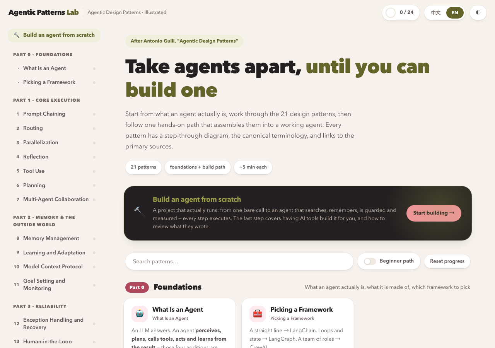
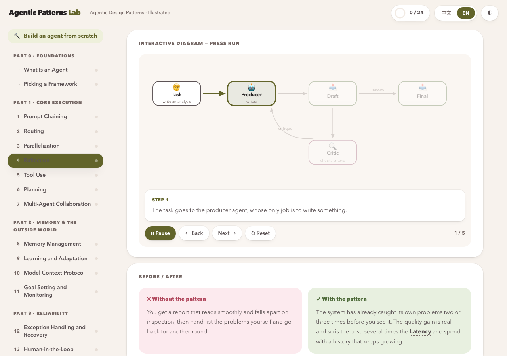
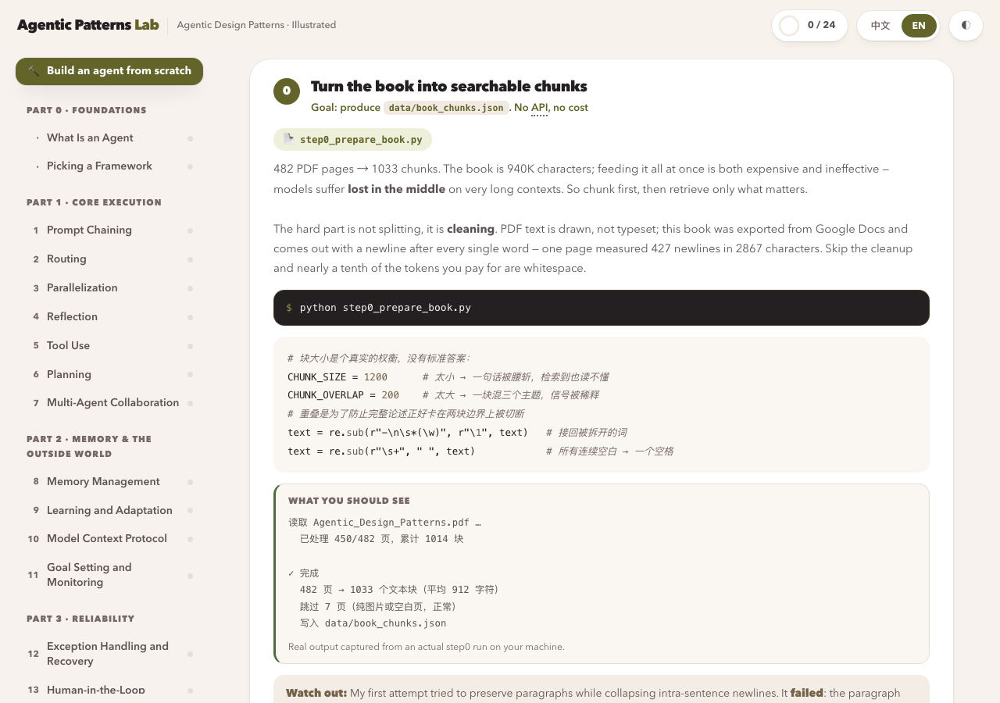
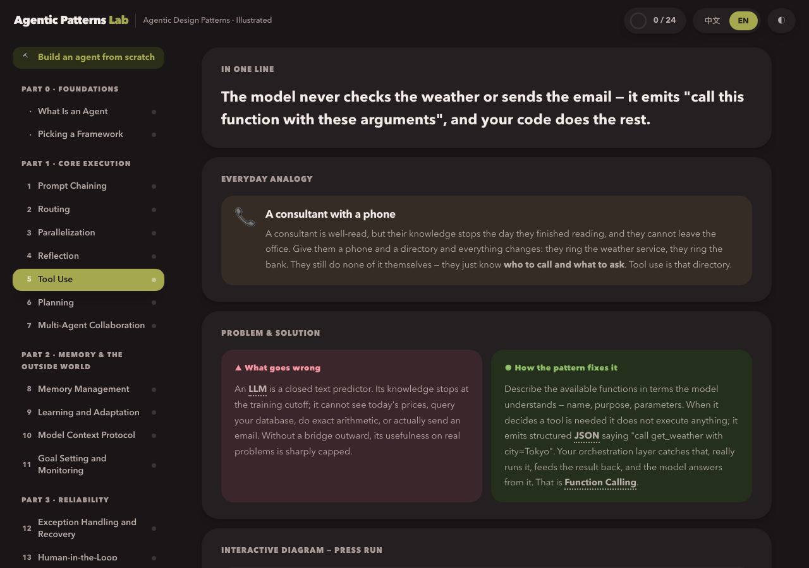
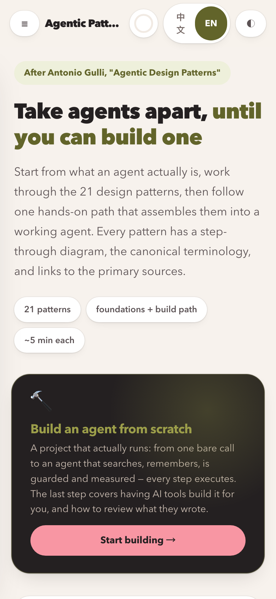

<p align="center">
  <strong>English</strong> · <a href="README.zh-CN.md">中文</a>
</p>

<p align="center">
  
</p>

<h1 align="center">Agentic Patterns Lab</h1>

<p align="center">
  <strong>Understand how AI agents actually work — without being an engineer.</strong><br>
  An independent, open-source visual learning companion for agentic design patterns.
</p>

<p align="center">
  <sub>Inspired by concepts discussed in Antonio Gulli's <i>Agentic Design Patterns</i>.<br>
  Not affiliated with, endorsed by, or sponsored by the author, Google, or Springer Nature.</sub>
</p>

<p align="center">
  <a href="https://agentic-patterns-lab.vercel.app/?lang=en"><strong>Live demo</strong></a> ·
  <a href="#the-two-halves">The two halves</a> ·
  <a href="#quick-start">Quick start</a> ·
  <a href="#screenshots">Screenshots</a> ·
  <a href="#attribution--licensing">Licensing</a>
</p>

---

## Why this exists

Antonio Gulli — a Distinguished Engineer in Google's CTO Office — wrote a 400-page book
on agentic design patterns and released it free. It is a genuinely good book.

It is also 400 dense pages of English with static diagrams. If you are not an engineer,
you will probably stop somewhere around chapter three. Which is a shame, because
everyone is talking about AI agents right now, and *waiting for someone to explain it
to you* is a bad place to be.

**This project is an independent learning companion, written for people who want to
understand the field without writing code.** It is not the book, an edition of the book,
or a substitute for it — it is original teaching material inspired by the same concepts.

- Every pattern is a diagram you can step through — press play and watch the data move
- Each one opens with an everyday analogy (reflection = writer and editor; routing =
  hospital triage; tool use = handing a consultant a phone and a directory), and only
  then gives you the precise definition
- **But it is never a dumbed-down summary.** Every pattern keeps the book's own
  terminology, its page numbers, and links to the primary papers — so you can always go
  and verify instead of taking my word for it

That last point is the whole design. Most beginner material is shallow; most rigorous
material is unreadable. This tries to be neither.

### The two halves

| | What it is | Who it's for |
|---|---|---|
| **`agentic-patterns-lab/`** | A bilingual interactive web app | **Anyone who wants to understand agents.** No coding, no install, no signup — open it and read |
| **`agent-workshop/`** | A Python project that runs | **Optional.** For when you decide you want to build one yourself |

You can ignore the second half entirely and still get the whole point. But if you go
there, the two halves connect: the web app's build-path page names the exact file and
command for each step, and every pattern page tells you which step uses it.

---

## 🔗 Live demo

The web app is fully static. **It calls no API and needs no key.** Open and use.

### 👉 **[agentic-patterns-lab.vercel.app](https://agentic-patterns-lab.vercel.app/?lang=en)**

It picks its language from your browser, and you can switch any time. Offline works too —
clone the repo and open `agentic-patterns-lab/index.html` directly. No build step,
nothing to install.

---

## The two halves

### 1. The learning platform — `agentic-patterns-lab/`

- **24 entries** — the book's 21 patterns, plus a foundations section (what an agent
  actually is / how to pick a framework) and Appendix A on prompting
- **Diagrams that run** — not pictures. Press `▶` to watch data flow through the pattern,
  or step through it yourself with `←` `→`
- **An analogy before the definition** — every pattern starts from something you already
  know, then earns the technical vocabulary
- **Bilingual, switchable** — every string exists in both languages; Chinese mode keeps
  the English technical terms so you can go and search for them
- **Canonical terminology + primary sources** — each pattern lists the book's own
  vocabulary and its references, so this is never a closed paraphrase you cannot verify
- **Quizzes and progress** — stored in localStorage, never sent anywhere
- **Light/dark, responsive**

Technically it is **zero-dependency and zero-build**: no ES modules (they break under
`file://`), system fonts only, and a stdlib-only `build.py` that inlines everything
into a single portable file.

### 2. The workshop — `agent-workshop/`

Nine Python files. The finished product answers questions about *Agentic Design
Patterns* itself — **the thing you study and the thing you build are the same object.**

| Step | File | What it adds |
|---|---|---|
| — | `check_setup.py` | Five checks, ending in one real API call |
| 0 | `step0_prepare_book.py` | PDF → retrievable chunks |
| 1 | `step1_bare_call.py` | One bare call — **not an agent yet** |
| 2 | `step2_chain.py` | Prompt chaining — **still a workflow, not an agent** |
| 3 | `step3_tools.py` | Tools + loop → **now it is an agent** |
| 4 | `step4_rag.py` | Hand-written TF-IDF retrieval; answers cite page numbers |
| 5 | `step5_memory.py` | Short-term and cross-session memory |
| 6 | `step6_guardrails.py` | Guardrails, prompt-injection defence, retry with backoff |
| 7 | `step7_eval.py` | Eval set, trajectory analysis, LLM-as-judge |
| + | `step8_with_framework.py` | The same agent in three lines with the official Tool Runner |
| + | `BUILD_WITH_AI.md` | Having AI tools build it — and **how to review what they wrote** |

**Why the first seven steps avoid frameworks.** Reach for a framework on day one and you
will never see what a tool call actually looks like — the framework hides it. So these
steps write the `while` loop by hand against the official SDK, so that **you see the raw
`tool_use` block the model emits.** Step 8 then shows the same thing in three lines, and
only then do you know what the framework saved you.

This is not an argument against tools. The last step says it plainly: in practice you
will have Claude Code write this for you. **What hand-writing buys you is not
independence from tools — it is the ability to review them.**

---

## Quick start

### Just want the web app

```bash
open agentic-patterns-lab/index.html
```

No build, no `npm install`. Edit `js/data-part*.js` to change content, then run
`python3 build.py` to regenerate the single-file bundle.

### Want to build the agent

```bash
cd agent-workshop
python3 -m venv .venv && source .venv/bin/activate
pip install -r requirements.txt
cp .env.example .env          # then paste in your own Anthropic API key
python check_setup.py         # go on only when everything is green
```

Then bring your own PDF (see [licensing](#attribution--licensing)) and run:

```bash
python step0_prepare_book.py /path/to/your.pdf
```

**That step costs nothing and needs no network.** Neither does
`python retrieval.py "reflection producer critic"`, which verifies retrieval on its own.
The API key is only needed from `step1` onward.

> Cost: running all the steps once is a few tens of thousands of tokens — **well under a
> dollar**. Swap `MODEL` at the top of each file to `claude-sonnet-5` or
> `claude-haiku-4-5` to spend less.

### How far the code is verified

Stated plainly, because it tells you what to suspect first when something breaks:

- **Verified to run** (no API key required — you can reproduce these after cloning):
  `step0` turning a 482-page PDF into 1033 chunks; `retrieval.py` finding the
  Producer/Critic passage on page 66 at score 0.615; every file passing syntax checks;
  and the offline paths — the safe calculator (including a rejected `eval` injection),
  the retrieval tool, input and output guardrails, the deterministic eval checks, and
  automatic tool-schema generation.
- **Not verified**: the lines in `step1`–`step8` that actually make network calls.
  This is real code written against the current Anthropic SDK, not pseudocode, but
  **the author has no API key configured, so the live calls have never executed.**
  You may well be the first person to run them — **please open an issue** if something
  breaks. That is genuinely useful to this project.

---

## Screenshots

<table>
<tr>
<td width="50%">
<br>
<strong>Diagrams you can step through</strong><br>
A token travels the edges while the caption below explains that step. Play it, or walk it yourself.
</td>
<td width="50%">
<br>
<strong>The build path points at real files</strong><br>
Each step names the file, the command, the output to expect, and the trap waiting for you.
</td>
</tr>
<tr>
<td width="50%">
<br>
<strong>Both themes, contrast-checked</strong><br>
Follows your system, switchable by hand. Body text meets WCAG AA in both.
</td>
<td width="50%" align="center">
<br>
<strong>Readable on a phone</strong><br>
Diagrams scroll horizontally inside their own container; the page never does.
</td>
</tr>
</table>

---

## Project layout

```
.
├── agentic-patterns-lab/       # the learning platform (pure static)
│   ├── index.html              #   shell + all inlined CSS
│   ├── js/
│   │   ├── diagram.js          #   declarative SVG diagram engine
│   │   ├── app.js              #   routing / i18n / progress / quizzes
│   │   ├── data-part*.js       #   the 24 entries
│   │   ├── data-build.js       #   the build-path page
│   │   └── glossary.js
│   ├── build.py                #   stdlib only → single-file dist/
│   └── vercel.json             #   cache + security headers
│
├── agent-workshop/             # the workshop (runs locally)
│   ├── README.md               #   setup guide written for total beginners
│   ├── BUILD_WITH_AI.md        #   building it with AI tools + a review checklist
│   ├── retrieval.py            #   hand-written TF-IDF retrieval
│   ├── step0..step8_*.py
│   └── data/                   #   generated by step0, gitignored
│
└── docs/screenshots/en/
```

---

## Source material and attribution

This project references concepts and terminology discussed in Antonio Gulli's
*Agentic Design Patterns: A Hands-On Guide to Building Intelligent Systems*.

The explanations, learning paths, analogies, exercises, comparisons, diagrams and the
product implementation in this repository are independently created unless otherwise
noted. The section structure is this project's own and does not follow the book's
chapter skeleton.

What is reproduced from the book is factual reference material: pattern names, chapter
names, canonical terminology, page numbers, and the reference lists each chapter cites —
all of it there so you can go back to the original and check.

Third-party material is identified in [`THIRD_PARTY_NOTICES.md`](THIRD_PARTY_NOTICES.md).

## Copyright / content policy

Please do not commit or redistribute:

- the original book PDF;
- full chapter text;
- large extracted passages from the book;
- scans or screenshots of interior book pages;
- third-party diagrams, unless a license clearly permits reuse.

Short quotations, where included, should be limited, attributed, and used only where
necessary for commentary or explanation.

`agent-workshop/step0_prepare_book.py` turns a PDF into local search chunks. It reads a
file **you** supply; its output (`data/`) is gitignored and has never been committed.

## Attribution & licensing

**Please read this section before forking.**

- **The book is not in this repository.** `agent-workshop/data/` is gitignored — it holds
  the full text of the book in chunked form, and shipping it would be republishing the
  book. Bring your own PDF and run `step0` yourself. **Any PDF works**; the remaining
  steps need no changes.
- **The explanations here are original, not copied.** The ten longest English passages on
  the site were each checked back against the book's text: **zero verbatim matches.**
  What is reproduced is terminology, chapter names, page numbers and reference lists —
  facts, used to point you at the original.
- **The book**: Antonio Gulli, *Agentic Design Patterns*. Check its own terms before use.
- Every pattern page cites the page numbers it maps to. **This is a companion, not a
  replacement.**

### License

Dual-licensed:

- **Code** — [MIT](LICENSE)
- **Content** (explanations, diagram copy, glossary, quiz questions) —
  [CC BY 4.0](LICENSE-CONTENT.md); use it freely, including commercially, with attribution

Unless otherwise noted, these cover **only the original material in this repository**.
Third-party books, artwork, screenshots, quotations, code samples, trademarks and other
referenced materials are **not** covered by the MIT License or CC BY 4.0 unless their own
license explicitly says so. See [`THIRD_PARTY_NOTICES.md`](THIRD_PARTY_NOTICES.md).

The book's content is not this project's to license — which is exactly why `data/` is
never published.

---

## Security

- API keys are **read from `.env` only** — never in code, comments or logs. `.env` is gitignored.
- **The web app holds no key and needs none** — it calls no API at all. That is both why it
  is safe to deploy statically and why it cannot run the agent for you: no web page should
  ever hold your key.
- **This repository contains no API key and requires none.** The workshop scripts use
  **the runner's own** key, read from their own local `.env`.
- Both `.gitignore` and `.vercelignore` are provided. Not redundant: the former governs Git
  deploys, while `vercel` CLI deploys upload **your local files**, where `.gitignore` may
  not save you.

If you fork this, run `git add -A && git status --short` before your first commit and
confirm no `.env`, `data/`, `*.pdf` or `.venv/` appears. **A key committed once lives in
the history forever** — rotating it is then the only fix.

`agent-workshop/BUILD_WITH_AI.md` has a ten-point checklist for auditing an agent that an
AI wrote for you.

---

<p align="center">
  <sub>Accessible without being shallow. That is the whole idea.</sub>
</p>
