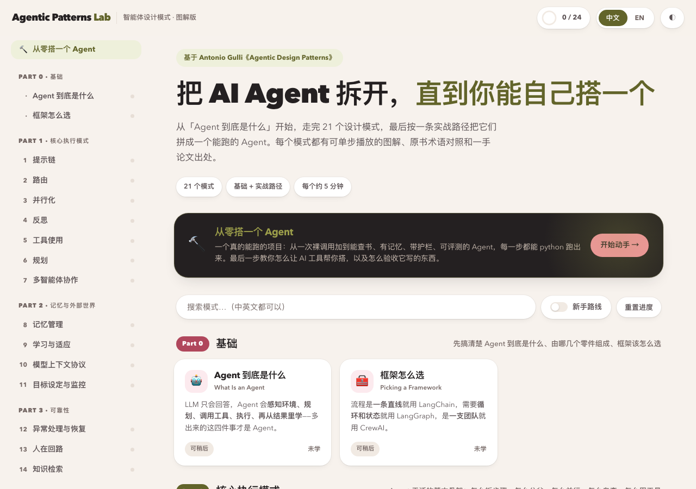
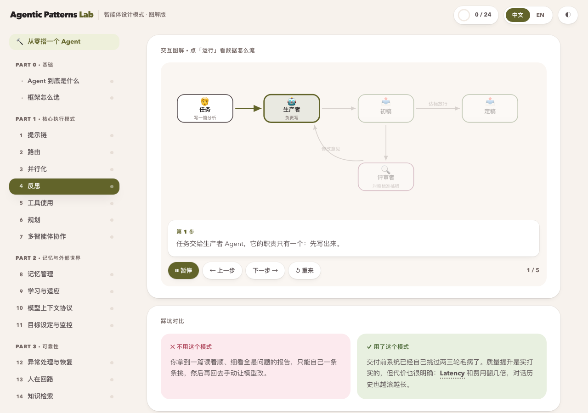
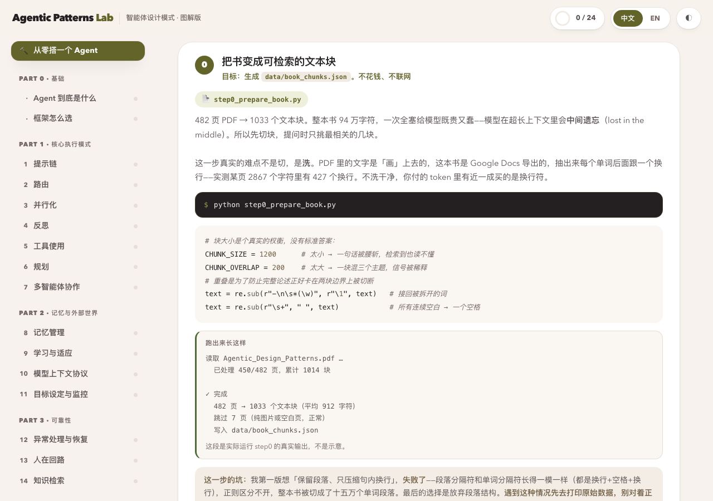
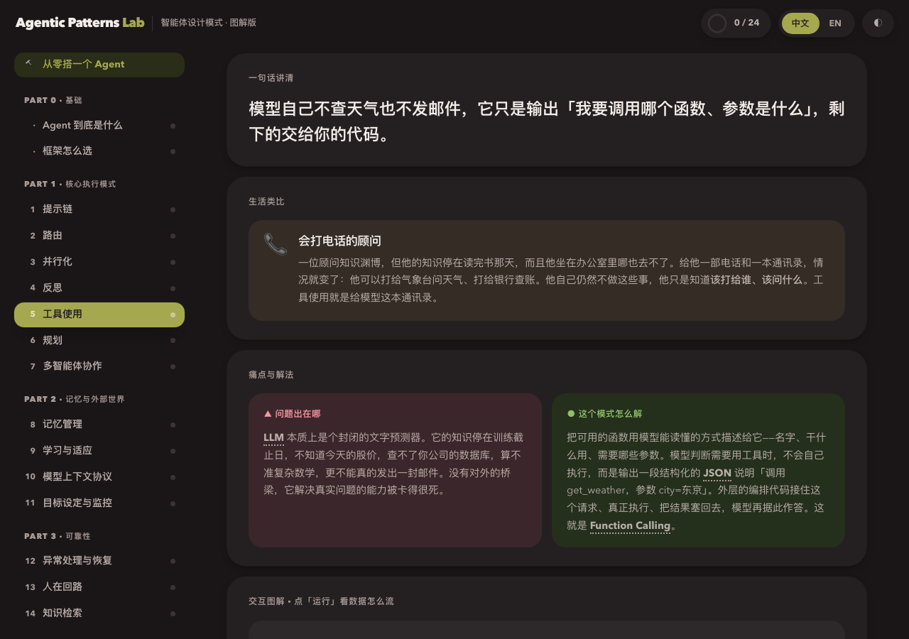
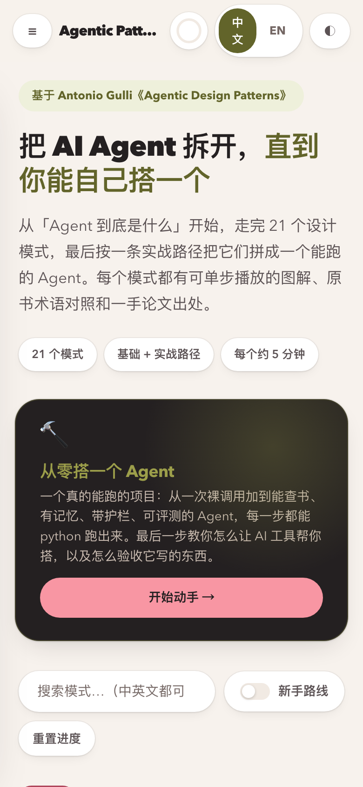

<p align="center">
  
</p>

<h1 align="center">Agentic Patterns Lab</h1>

<p align="center">
  把《Agentic Design Patterns》变成能看懂、能动手、能验收的东西。<br>
  <em>An illustrated, bilingual guide to agent design patterns — plus a workshop that actually runs.</em>
</p>

<p align="center">
  <a href="https://agentic-patterns-lab.vercel.app"><strong>在线体验</strong></a> ·
  <a href="#-两部分">两部分</a> ·
  <a href="#-快速开始">快速开始</a> ·
  <a href="#-界面">界面</a> ·
  <a href="#-版权说明">版权说明</a>
</p>

---

## 这是什么

读 Antonio Gulli 的《Agentic Design Patterns》时遇到的问题很具体：482 页、全英文、
流程图是静态的、每章十几页读下来容易丢主线。而读完之后还有个更大的问题——
**知道了 21 个模式的名字，依然不知道怎么搭一个 agent。**

这个项目是对这两个问题的回答，所以它有两半：

| | 是什么 | 解决什么 |
|---|---|---|
| **`agentic-patterns-lab/`** | 一个中英双语的交互式网页 | 看懂原理：24 个模式，每个都有可单步播放的图解、术语对照、一手论文出处 |
| **`agent-workshop/`** | 一个真能跑的 Python 项目 | 动手搭：九步递进，从一次裸调用到一个能问答 PDF 的 agent |

两半互相指：网页的「实战路径」页写清每一步对应哪个文件、敲什么命令、跑出来长什么样；
每个模式详情页底部会告诉你「这个模式在实战路径第几步用到」。

**建议左边开网页看原理，右边开终端跑代码。**

---

## 🔗 在线体验

网页部分是纯静态的，**不调任何 API，也不需要任何 key**，打开即用。

### 👉 **[agentic-patterns-lab.vercel.app](https://agentic-patterns-lab.vercel.app)**

不想联网也行：把仓库拉下来直接双击 `agentic-patterns-lab/index.html`，
完全离线，没有构建步骤，也不需要装任何东西。

---

## 📦 两部分

### 一、知识平台 `agentic-patterns-lab/`

- **24 个条目** — 原书 21 个模式 + 基础篇（Agent 到底是什么 / 框架怎么选）+ 附录 A 提示技术
- **可单步播放的图解** — 不是静态图片，是能按 `▶ 运行` 看数据怎么流、也能用 `← →` 自己一步步走的 SVG
- **中英随时切换** — 所有文案双语，术语在中文模式下保留英文原词，方便你回去查资料
- **术语对照 + 一手出处** — 每个模式给出原书的规范术语和参考文献，不做一个查不到源头的封闭转述
- **随堂小测 + 进度** — 存在 localStorage，纯本地，不联网
- **深浅色自适应**，手机上也能看

技术上是**零依赖、零构建**的：不用 ES modules（`file://` 下会被 CORS 拦），
只用系统字体，`build.py` 用标准库把所有 CSS/JS 内联成一个单文件。

### 二、实战项目 `agent-workshop/`

九个 Python 文件，每个都能单独 `python stepN.py` 跑。
`step0` 和检索模块**不需要 API key**，克隆下来就能验证；`step1` 起需要**你自己的** key。
（各步验证到什么程度，见 [agent-workshop/README.md](agent-workshop/README.md)。）
最终成品是一个能回答《Agentic Design Patterns》这本 PDF 的 agent——
**你学的材料和你搭出来的东西是同一个。**

| 步骤 | 文件 | 加了什么 |
|---|---|---|
| — | `check_setup.py` | 五项自检，最后真发一次请求 |
| 0 | `step0_prepare_book.py` | PDF → 可检索的文本块 |
| 1 | `step1_bare_call.py` | 一次裸调用（**还不是 agent**） |
| 2 | `step2_chain.py` | 提示链（**还是 workflow，不是 agent**） |
| 3 | `step3_tools.py` | 工具 + 循环 → **这一步才叫 agent** |
| 4 | `step4_rag.py` | 手写 TF-IDF 检索，回答带页码 |
| 5 | `step5_memory.py` | 短期 + 跨会话长期记忆 |
| 6 | `step6_guardrails.py` | 护栏、提示注入防护、重试退避 |
| 7 | `step7_eval.py` | 评测集 + 轨迹分析 + LLM 裁判 |
| 附 | `step8_with_framework.py` | 同样的东西，官方 Tool Runner 三行写完 |
| 附 | `BUILD_WITH_AI.md` | 用 AI 工具搭，以及**怎么验收它写的东西** |

**为什么前七步不用框架**：第一次搭 agent 就用框架，你会看不见工具调用真正长什么样——
框架把它包起来了。所以先用官方 SDK 手写那个 `while`，**让你亲眼看见模型吐出的那段 `tool_use`**，
step8 再展示「同样的东西框架三行搞定」。那时你才知道框架替你省了什么。

这不是反对用工具。最后一步讲得很直白：现实里你多半会让 Claude Code 帮你写，
**手写给你的不是「不用工具的能力」，是验收能力**——它写歪的时候你知道去哪儿看。

---

## 🚀 快速开始

### 只想看网页

```bash
open agentic-patterns-lab/index.html
```

没有构建步骤，没有 `npm install`。要改内容就编辑 `js/data-part*.js`，
改完跑 `python3 build.py` 重新生成单文件版。

### 想动手搭 agent

```bash
cd agent-workshop
python3 -m venv .venv && source .venv/bin/activate
pip install -r requirements.txt
cp .env.example .env          # 然后把你的 API key 填进去
python check_setup.py         # 全绿了再往下走
```

然后你需要一份 PDF（见下方版权说明），先跑：

```bash
python step0_prepare_book.py /你的/书.pdf
```

**这一步不花钱、不联网**，跑完就能用 `python retrieval.py "reflection producer critic"`
验证检索——同样不花钱。需要 API key 的是 `step1` 往后。

> 成本参考：七步全跑一遍大约几万 token，**几毛到几块人民币**。
> 想更省可以把各文件顶部的 `MODEL` 换成 `claude-sonnet-5` 或 `claude-haiku-4-5`。

---

## 🖼 界面

<table>
<tr>
<td width="50%">
<br>
<strong>可单步播放的图解</strong><br>
数据小球沿着连线走，底下同步显示这一步在干什么。也可以用 ← → 自己一步步走。
</td>
<td width="50%">
<br>
<strong>实战路径指向真实文件</strong><br>
每步标明文件名、要敲的命令、跑出来长什么样、以及会踩的坑。
</td>
</tr>
<tr>
<td width="50%">
<br>
<strong>深浅色都做过对比度校验</strong><br>
跟随系统，也可手动切换。两种主题下正文对比度均达 WCAG AA。
</td>
<td width="50%" align="center">
<br>
<strong>手机上也能读</strong><br>
流程图在窄屏可横向滚动，页面本身不会横向溢出。
</td>
</tr>
</table>

---

## 📁 项目结构

```
.
├── agentic-patterns-lab/       # 知识平台（纯静态网页）
│   ├── index.html              #   外壳 + 全部内联 CSS
│   ├── js/
│   │   ├── diagram.js          #   声明式 SVG 图解引擎
│   │   ├── app.js              #   路由 / 双语 / 进度 / 小测
│   │   ├── data-part*.js       #   24 个模式的内容
│   │   ├── data-build.js       #   实战路径页
│   │   └── glossary.js         #   术语表
│   ├── build.py                #   标准库，合成单文件 dist/
│   └── dist/index.html         #   可直接部署的成品
│
├── agent-workshop/             # 实战项目（本地 Python）
│   ├── README.md               #   零基础环境指南
│   ├── BUILD_WITH_AI.md        #   用 AI 工具搭 + 验收清单
│   ├── check_setup.py
│   ├── retrieval.py            #   手写 TF-IDF 检索
│   ├── step0..step8_*.py
│   └── data/                   #   step0 生成，已 gitignore
│
└── docs/screenshots/           # README 用图
```

---

## ⚖️ 版权说明

**这一节请读完再 fork。**

- **原书不包含在本仓库里。** `agent-workshop/data/` 已被 gitignore——
  那个目录里是原书全文切块的结果，随仓库发布等于公开转载整本书。
  你需要自备一份 PDF，然后自己跑 `step0`。换成**任何一本 PDF 都行**，
  后面七步一行代码都不用改。
- **网页里的讲解是重写的，不是照抄。** 页面上最长的十段英文都逐段回原书检索比对过，
  **零段逐字命中**。照搬的只有术语、章节名、页码和参考文献——这些是事实。
- **原书**：Antonio Gulli, *Agentic Design Patterns*。使用前请自行确认其授权条款。
- 每个模式页底部都标了对应的原书页码，方便你回原文精读。**这个项目是导读，不是替代品。**

### 许可证

本仓库是双许可证：

- **代码** —— [MIT](LICENSE)
- **文字内容**（讲解、图解文案、术语表、小测题目）—— [CC BY 4.0](LICENSE-CONTENT.md)，
  注明出处即可自由使用，包括商业用途

许可证只覆盖**本仓库自己的产出**。原书内容不属于本项目，也无法由本项目授权——
这正是 `data/` 不随仓库发布的原因。详见 [LICENSE-CONTENT.md](LICENSE-CONTENT.md)。

---

## 🔐 安全

这个项目的密钥策略，也是 `agent-workshop` 里反复讲的那套：

- API key **只从 `.env` 读**，不写进代码、注释或日志。`.env` 在 `.gitignore` 里。
- **网页部分不持有也不需要任何 key**——它压根不调 API。这既是它能安全静态部署的原因，
  也是为什么它不能替你跑 agent：任何网页都不该拿到你的 key。
- **本仓库不包含任何 API key，也不需要。** `agent-workshop` 里的脚本用的是
  **运行者自己的** key，从各自本地的 `.env` 读取。
- 根目录同时提供 `.gitignore` 和 `.vercelignore`。两份不是冗余：从 Git 部署时前者生效，
  而用 `vercel` CLI 从本地直接部署时上传的是**你本地的文件**，那时 `.gitignore` 不一定兜得住。

**如果你 fork 或克隆了这个项目**，第一次提交前建议跑一遍：

```bash
git add -A && git status --short
```

确认清单里没有 `.env`、`data/`、`*.pdf`、`.venv/`。
**`.env` 一旦被提交过一次就永远留在 git 历史里**，后面再删也没用——只能换 key。

想系统地查一份 AI 写出来的 agent 有没有这类问题，
`agent-workshop/BUILD_WITH_AI.md` 里有一份十条的验收清单。

---

<p align="center">
  <sub>教材与练习册是同一份材料——这是这个项目唯一的设计主张。</sub>
</p>
